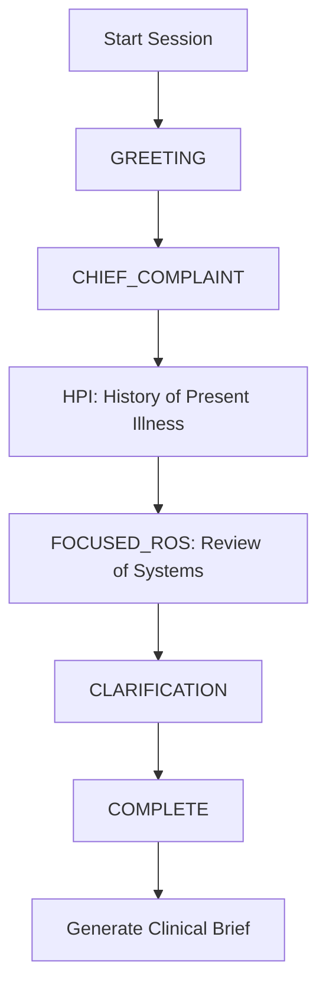
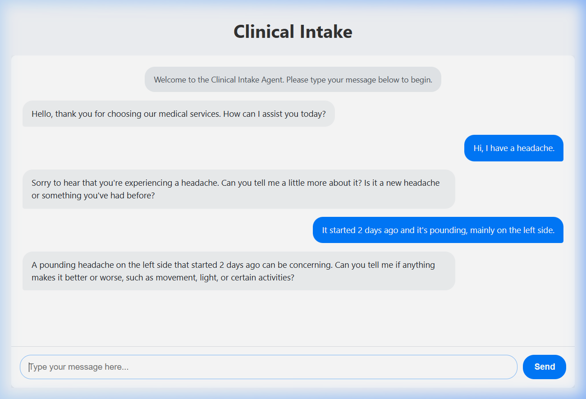

# Clinical Intake Agent

An intelligent Clinical Intake Agent designed to systematically collect patient information before a clinical consultation. It uses a conversational chat interface powered by large language models to gather symptoms, chief complaints, and patient histories, outputting a structured Clinical Brief for healthcare providers.

## 🚀 How It Works (The Flow)

The agent operates in structured stages to ensure all necessary clinical information is gathered systematically without overwhelming the patient:



1. **Greeting**: The agent welcomes the patient and asks for the main reason for their visit.
2. **Chief Complaint**: Identifies the primary symptom or issue.
3. **History of Present Illness (HPI)**: Explores the symptom in depth (onset, location, duration, character, aggravating/alleviating factors, etc.).
4. **Focused Review of Systems (ROS)**: Asks about associated symptoms to evaluate potential conditions.
5. **Clarification**: Wraps up any loose ends or missing context.
6. **Brief Generation**: Synthesizes the entire conversation into a structured JSON `ClinicalBrief` ready for the doctor's review.

## 📸 Product Demo

Here is a full demonstration of the Clinical Intake Agent in action from start to finish:

### Demo Video


### Chat Interface Screenshot


## 🛠️ Installation & Setup

1. Clone the repository and navigate to the project folder.
2. Install the required dependencies:
```bash
pip install -r requirements.txt
```
3. Set up your `.env` file (see `.env.example`). Provide your `LLM_PROVIDER` and corresponding API keys (e.g., `OPENROUTER_API_KEY`).
4. Start the application server:
```bash
python main.py
```
5. Open your browser to `http://localhost:8080/` to interact with the agent.

## 🧪 Testing

The project includes a comprehensive test suite covering unit, integration, and end-to-end (E2E) testing.

### Test Types
- **Unit Tests**: Test core utility functions, JSON parsing logic, and LLM provider selection.
- **Integration Tests**: Test API endpoints (`/chat`, `/brief`) using FastAPI `TestClient` with mocked LLM responses.
- **End-to-End Tests**: Full browser-based automation using Playwright to verify the complete patient journey and brief generation.

### Running Tests
To run all tests:
```bash
pytest tests/ -v
```

## 📝 License

This project is licensed under the MIT License - see the [LICENSE](LICENSE) file for details.
